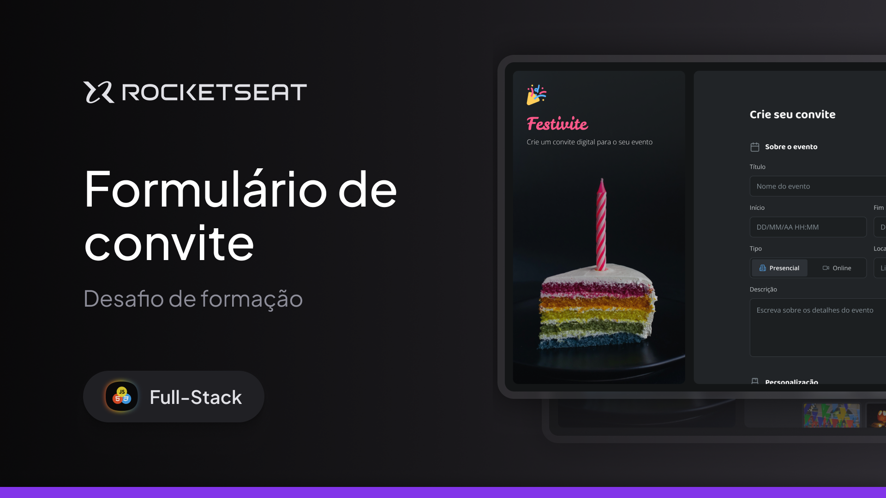

# Formulário de Convite — Festivite

[Tecnologias](#-tecnologias) | [Projeto](#-projeto) | [Layout](#-layout) | [Licença](#-licença)



## 🚀 Tecnologias

Este projeto foi desenvolvido com as seguintes tecnologias:

- [HTML5](https://developer.mozilla.org/pt-BR/docs/Web/HTML)
- [CSS3](https://developer.mozilla.org/pt-BR/docs/Web/CSS)
- [JavaScript](https://developer.mozilla.org/pt-BR/docs/Web/JavaScript)
- [Figma](https://www.figma.com/)

## 💻 Projeto

Formulário para criação de convites digitais da **Festivite**, desenvolvido como desafio da formação **Full-Stack da Rocketseat**.

A página reúne em um só fluxo tudo o que é preciso para montar o convite de um evento: informações principais, personalização visual e dados de contato, com validação nativa do navegador e controles totalmente acessíveis por teclado.

O formulário está organizado nas seguintes seções:

- **Marca** com logo, nome e chamada da Festivite sobre imagem de fundo
- **Sobre o evento** com título, data e horário de início e fim, tipo (presencial ou online), local e descrição
- **Personalização** com seleção da cor principal, tema do evento, estilo claro/escuro e upload da foto de capa
- **Dados para contato** com nome, e-mail e telefone
- **Termos e preferências** com aceite dos termos e opções de comunicação por e-mail e SMS
- **Ação final** para gerar o convite

### Como executar

O projeto utiliza HTML, CSS e JavaScript puros, sem dependências externas ou etapa de build.

Clone o repositório e acesse a pasta do projeto:

```bash
git clone https://github.com/devnalberth/formulariodeconvite.git
cd formulariodeconvite
```

Inicie um servidor local:

```bash
python3 -m http.server 5500
```

Acesse no navegador:

```text
http://localhost:5500
```

> Também é possível usar a extensão **Live Server** do VS Code. Abra o projeto por um servidor local, e não direto pelo arquivo: os ícones do seletor Presencial/Online são aplicados com `mask-image`, que o navegador bloqueia em arquivos abertos via `file://`.

## 🎨 Layout

O layout foi implementado a partir do arquivo do Figma disponibilizado pela Rocketseat, seguindo os tokens de cor, tipografia e espaçamento do design.

Principais características:

- Tema escuro com tokens de cor centralizados em variáveis CSS
- Tipografia com **Leckerli One** na marca, **Baloo 2** nos títulos e **Open Sans** nos textos
- Layout em duas colunas no desktop, com a marca fixa e o formulário com rolagem própria
- Versão responsiva empilhada para tablet e mobile
- Controle segmentado, seletor de cores, cards de tema e switch construídos com inputs nativos (`radio` e `checkbox`)
- Estados de erro exibidos somente após a interação do usuário (`:user-invalid`)
- Upload de arquivo personalizado com exibição do nome selecionado
- Foco visível em todos os controles e suporte a preferências de movimento reduzido

## 📁 Estrutura do projeto

```text
formulariodeconvite/
├── assets/
│   ├── icons/
│   │   └── *.svg
│   └── images/
│       ├── themes/
│       ├── brand.jpg
│       └── Cover.png
├── scripts/
│   └── main.js
├── styles/
│   ├── form.css
│   ├── global.css
│   ├── index.css
│   └── layout.css
├── index.html
└── README.md
```

## 📝 Licença

Este projeto foi desenvolvido como desafio da formação Full-Stack da [Rocketseat](https://www.rocketseat.com.br/), para fins de estudo.

---

Feito por **Nalberth Web**
